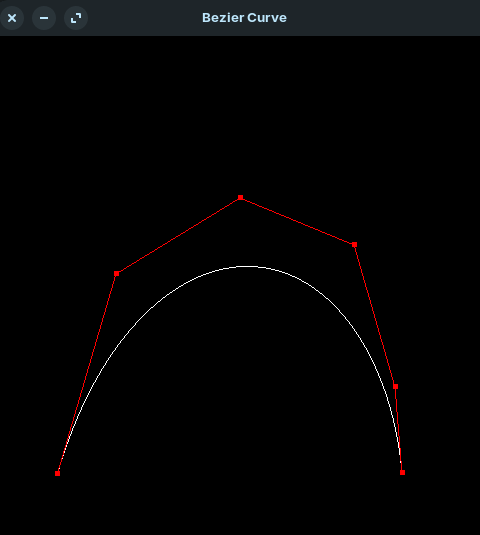
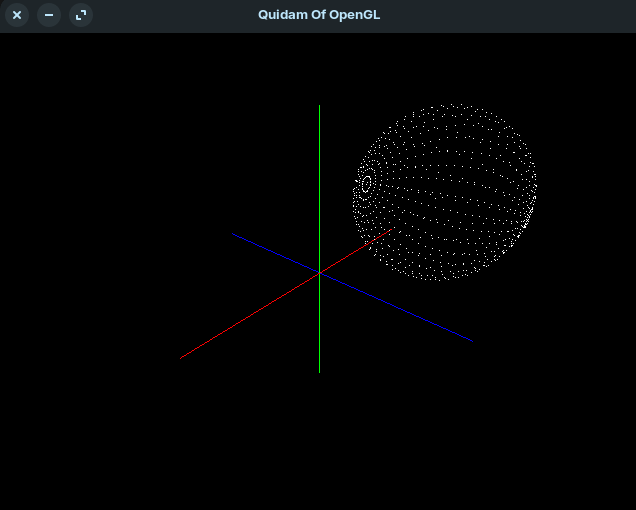
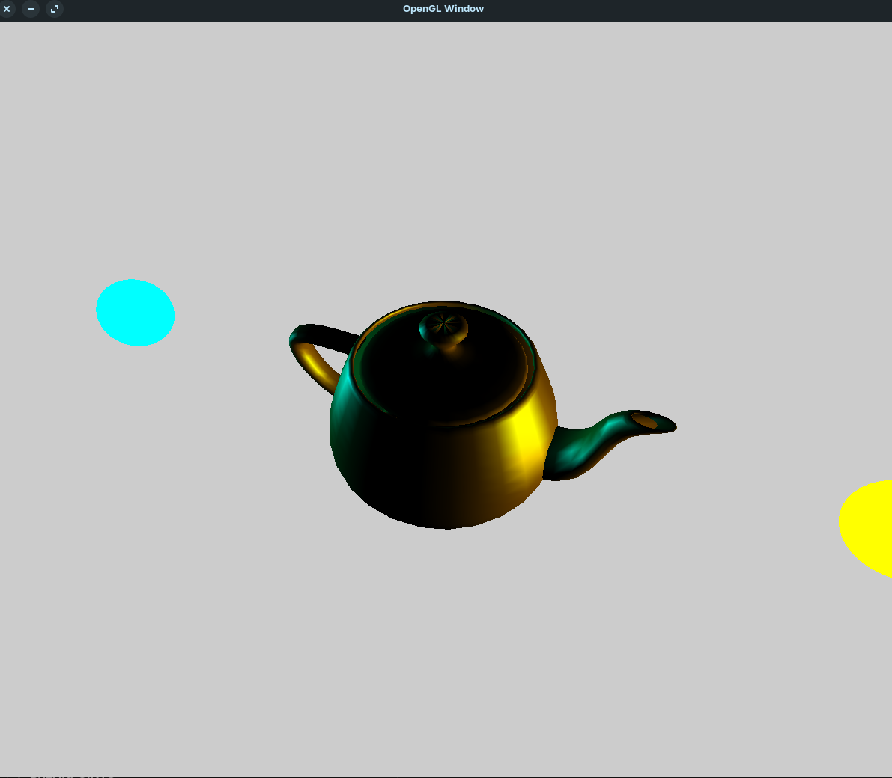
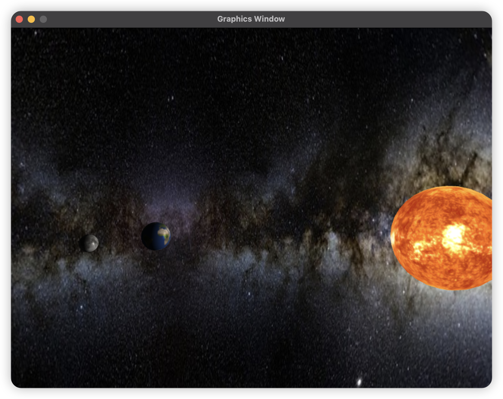

# Hangzhoudianzi University CG Homework

## Preface

This is computer graphics homeworks from Hangzhoudianzi University.

- Ubuntu22.04
- Pyopengl
- Pygame

The following project is very suitable for beginners to practice, it has a lot of examples can be directly executed, very good project!

Link: [https://github.com/ax-va/PyOpenGL-Pygame-Stemkoski-Pascale-2021](https://github.com/ax-va/PyOpenGL-Pygame-Stemkoski-Pascale-2021)

These code is only for submitting a homework, so please forgive any errors.

## 1. Bezier line

- click to add points
- hold down the left button to drag the points

## 2. 3DTrans

- w, a, s, d to move camera, or hold down left button to drag it
- 1, 2, 3 for x, y, z axis symmetry
- u, i, o for x, y, z axis rotation
- z, x, c for x, y, z axis panning
- j, k, l for x, y, z axis shear
- r for restore
- 8, 9, 0 for geometry option

## 3. Color

- simple phong light model

There is currently a bug that you should hold down left button and drag a little then it will make sense.

## 4. Final

This work mostly from *PyOpenGL-Pygame-Stemkoski-Pascale-2021*

Link: [https://github.com/ax-va/PyOpenGL-Pygame-Stemkoski-Pascale-2021](https://github.com/ax-va/PyOpenGL-Pygame-Stemkoski-Pascale-2021)

Superb programer! Many interesting examples!

